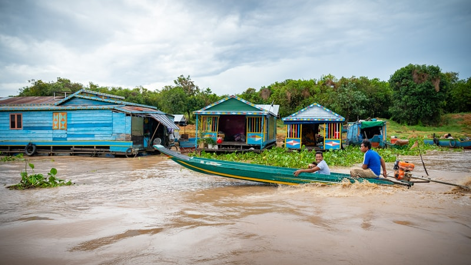

Another tragedy. Had single watch to-night, as crew too tired to double. When morning watch came on deck could find no one except steersman. Raised outcry, and all came on deck. Thorough search, but no one found. Are now without second mate, and crew in a panic. Mate and I agreed to go armed henceforth and wait for any sign of cause. 30 July.--Last night. Rejoiced we are nearing England. Weather fine, all sails set. Retired worn out; slept soundly; awaked by mate telling me that both man of watch and steersman missing. Only self and mate and two hands left to work ship.

### Road blocked due to land slide

Two days of fog, and not a sail sighted. Had hoped when in the English Channel to be able to signal for help or get in somewhere. Not having power to work sails, have to run before wind. Dare not lower, as could not raise them again. We seem to be drifting to some terrible doom. Mate now more demoralised than either of men. His stronger nature seems to have worked inwardly against himself. Men are beyond fear, working stolidly and patiently, with minds made up to worst. They are Russian, he Roumanian.

### Medicin delivered more than 3000 people

Woke up from few minutes' sleep by hearing a cry, seemingly outside my port. Could see nothing in fog. Rushed on deck, and ran against mate. Tells me heard cry and ran, but no sign of man on watch. One more gone. Lord, help us! Mate says we must be past Straits of Dover, as in a moment of fog lifting he saw North Foreland, just as he heard the man cry out. If so we are now off in the North Sea, and only God can guide us in the fog, which seems to move with us; and God seems to have deserted us.

At midnight I went to relieve the man at the wheel, and when I got to it found no one there. The wind was steady, and as we ran before it there was no yawing. I dared not leave it, so shouted for the mate. After a few seconds he rushed up on deck in his flannels. He looked wild-eyed and haggard, and I greatly fear his reason has given way. He came close to me and whispered hoarsely, with his mouth to my ear, as though fearing the very air might hear: "It is here; I know it, now. On the watch last night I saw It, like a man, tall and thin, and ghastly pale. It was in the bows, and looking out.

> We are working 24x7 to rescue as much people as possible in less time. - Army General

I crept behind It, and gave It my knife; but the knife went through It, empty as the air." And as he spoke he took his knife and drove it savagely into space. Then he went on: "But It is here, and I'll find It. It is in the hold, perhaps in one of those boxes. I'll unscrew them one by one and see. You work the helm." And, with a warning look and his finger on his lip, he went below. There was springing up a choppy wind, and I could not leave the helm. I saw him come out on deck again with a tool-chest and a lantern, and go down the forward hatchway. He is mad, stark, raving mad, and it's no use my trying to stop him. He can't hurt those big boxes: they are invoiced as "clay," and to pull them about is as harmless a thing as he can do. So here I stay, and mind the helm, and write these notes. I can only trust in God and wait till the fog clears. Then, if I can not steer to any harbour with the wind that is, I shall cut down sails and lie by, and signal for help.
