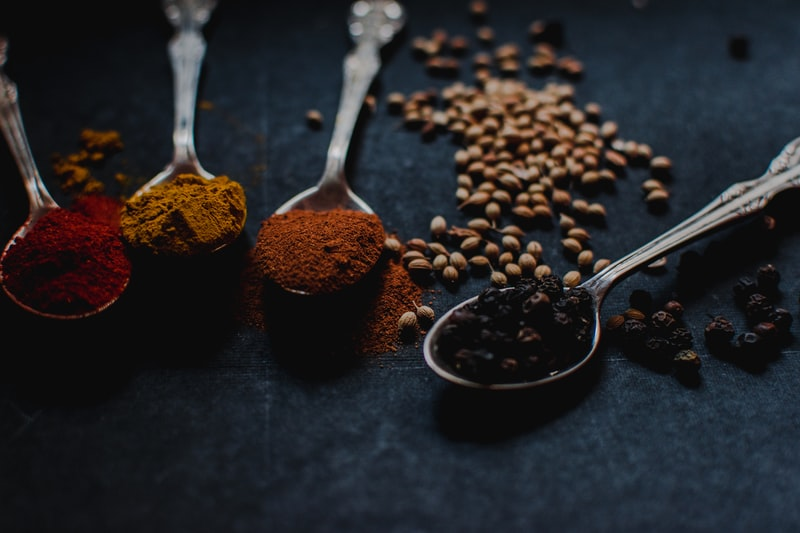
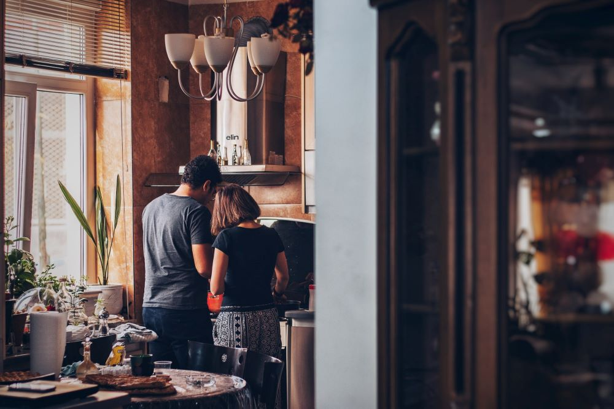

You cannot too assiduously attend to Madame Duval herself; but I would wish you to mix as little as possible with her associates, who are not likely to be among those whose acquaintance would reflect credit upon you. Remember, my dear Evelina, nothing is so delicate as the reputation of a woman; it is at once the most beautiful and most brittle of all human things.

Adieu, my beloved child; I shall be but ill at ease till this month is elapsed. A.V. EVELINA TO THE REV. MR. VILLARS London, June 6.

### The greatest dishes are very simple

ONCE more, my dearest Sir, I write to you from this great city. Yesterday morning, with the truest concern, I quitted the dear inhabitants of Howard Grove, and most impatiently shall I count the days till I see them again. Lady Howard and Mrs. Mirvan took leave of me with the most flattering kindness; but indeed I knew not how to part with Maria, whose own apparent sorrow redoubled mine.

She made me promise to send her a post: and I shall write to her with the same freedom, and almost the same confidence, you allow me to make use of to yourself.

### Everyone has taste, even if they don't realize it

The Captain was very civil to me: but he wrangled with poor Madame Duval to the last moment; and, taking me aside, just before we got into the chaise, he said, "Hark'ee, Miss Anvile, I've a favour for to ask of you, which is this; that you will write us word how the old gentlewoman finds herself, when she sees it was all a trick; and what the French lubber says to it, and all about it."

> Cooking is at once child's play and adult joy. And cooking done with care is an act of love

I answered that I would obey him, though I was very little pleased with the commission, which, to me, was highly improper; but he will either treat me as an informer, or make me a party in his frolic.

As soon as we drove away, Madame Duval, with much satisfaction, exclaimed, "Dieu merci, we've got off at last! I'm sure I never desire to see that place again. It's a wonder I've got away alive; for I believe I've had the worst luck ever was known, from the time I set my foot upon the threshold. I know I wish I'd never a gone. Besides, into the bargain, it's the most dullest place in all Christendom: there's never no diversions, nor nothing at all."

### If you think well, you cook well

Then she bewailed M. Du Bois; concerning whose adventures she continued to make various conjectures during the rest of our journey.

When I asked her what part of London she should reside in, she told me that Mr. Branghton was to meet us at an inn, and would conduct us to a lodging. Accordingly, we proceeded to a house in Bishopsgate Street, and were led by a waiter into a room where we found Mr. Branghton.

He received us very civilly; but seemed rather surprised at seeing me, saying, "Why, I didn't think of your bringing Miss; however, she's very welcome."

"I'll tell you how it was," said Madame Duval: "you must know I've a mind to take the girl to Paris, that she may see something of the world, and improve herself a little; besides, I've another reason, that you and I will talk more about. But, do you know, that meddling old parson, as I told you of, would not let her go: however, I'm resolved I'll be even with him; for I shall take her on with me, without saying never a word more to nobody."

I started at this intimation, which very much surprised me. But, I am very glad she has discovered her intention, as I shall be carefully upon my guard not to venture from town with her.

Mr. Branghton then hoped we had passed our time agreeably in the country.

"O Lord, cousin," cried she, "I've been the miserablest creature in the world! I'm sure all the horses in London sha'n't drag me into the country again of one while: why, how do you think I've been served?-only guess."

<!--EndFragment-->
