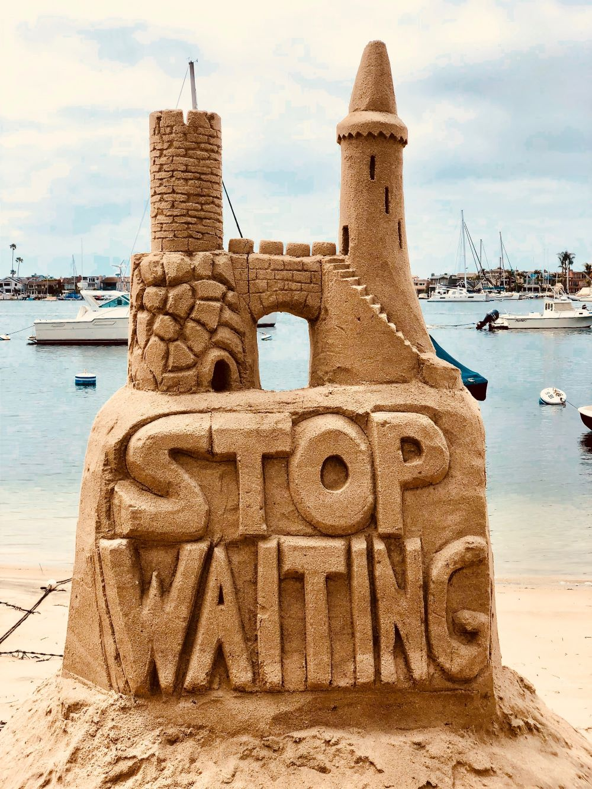

I believe we were some minutes in this extraordinary situation; but, as my strength returned, I felt myself both ashamed and awkward, and moved towards the door. Pale and motionless, he suffered me to pass, without changing his posture, or uttering a syllable; and, indeed, He look'd a bloodless image of despair.-POPE. When I reached the door, I turned round; I looked fearfully at the pistols, and, impelled by an emotion I could not repress, I hastily stepped back, with an intention of carrying them away: but their wretched owner, perceiving my design, and recovering from his astonishment, darting suddenly down seized them both himself.

### Live a better life

Wild with fright, and scarce knowing what I did, I caught, almost involuntarily, hold of both his arms, and exclaimed, "O, Sir! have mercy on yourself!"

The guilty pistols fell from his hands, which, disengaging from me, he fervently clasped, and cried, "Sweet Heaven! is this thy angel?"

Encouraged by such gentleness, I again attempted to take the pistols; but, with a look half frantic, he again prevented me, saying "What would you do?"

> Travel is the only thing you buy that makes you richer.

"Awaken you," I cried, with a courage I now wonder at, "to worthier thoughts, and rescue you from perdition."

I then seized the pistols; he said not a word,-he made no effort to stop me;-I glided quick by him, and tottered down stairs ere he had recovered from the extremest amazement.

### Enjoy the road

The moment I reached again the room I had so fearfully left, I threw away the pistols, and flinging myself on the first chair, gave free vent to the feelings I had most painfully stifled, in a violent burst of tears, which, indeed, proved a happy relief to me.

In this situation I remained some time; but when, at length, I lifted up my head, the first object I saw was the poor man who had occasioned my terror, standing, as if petrified, at the door, and gazing at me with eyes of wild wonder.

I started from the chair; but trembled so excessively, that I almost instantly sunk again into it. He then, though without advancing, and, in a faultering voice, said, "Whoever, or whatever you are, relieve me, I pray you, from the suspense under which my soul labours-and tell me if indeed I do not dream?"

To this address, so singular, and so solemn, I had not then the presence of mind to frame any answer; but as I presently perceived that his eyes turned from me to the pistols, and that he seemed to intend regaining them, I exerted all my strength, and saying, "O, for Heaven's sake forbear!" I rose and took them myself.

> Do my sense deceive me!" cried he, "do I live-? And do you?

As he spoke he advanced towards me; and I, still guarding the pistols, retreated, saying, "No, no-you must not-must not have them!"

"Why-for what purpose, tell me!-do you withhold them?"-

"To give you time to think,-to save you from eternal misery; -and, I hope, to reserve you for mercy and forgiveness."

<!--EndFragment-->
