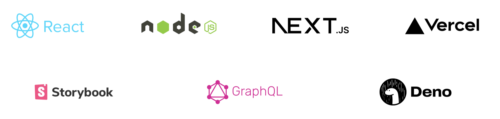

Headless Services Experiences with WordPress for an adaptable tech stack
Many advantages come with headless architecture, but making the appropriate partner choice is essential to reaping the full benefits.

### Why become headless?

A headless CMS is an architecture for backend websites that can switch between many front-end frameworks to provide flexible content delivery on various platforms and devices.

The good news is that you don't have to commit "all in" right now. It can construct all of our websites with REST API readiness, so you can easily switch if you ever need more flexibility.

Headless is preferred by organizations because it enables a best-in-class technology stack, enabling creative front-end frameworks and channels to rapidly develop and produce next-generation user experiences.

All of this frees up creative teams to concentrate on user experience and design without interference.

Gain from headless with the professionals at  JakartaJs
The versatility and wide range of tech stacks that decoupled headless websites enable have made them popular.

You have more control over how your website functions thanks to the WordPress REST API's design, which also makes it possible to extend it powerfully for unique business logic, third-party integrations, and custom data formats.

stacks without heads in all sizes and forms
There is a solution for you, ranging from hybrid techniques to loosely decoupled methods. We employ a variety of instruments, such as:

### Discover your headless flow.

It is imperative to establish an appropriate stack and architecture to guarantee that the WordPress CMS functions as intended.

Common considerations include the ability to preview unpublished material in a decoupled architecture, effective use of REST API batching, and SEO tags (via Yoast or similar).

We've worked on a wide range of deployments and have access to a wealth of pre-existing solutions, ranging from Akamai NetStorage and Static Page Generation to Single Page Applications (SPAs) and decoupled Node.js SSR-only static sites.