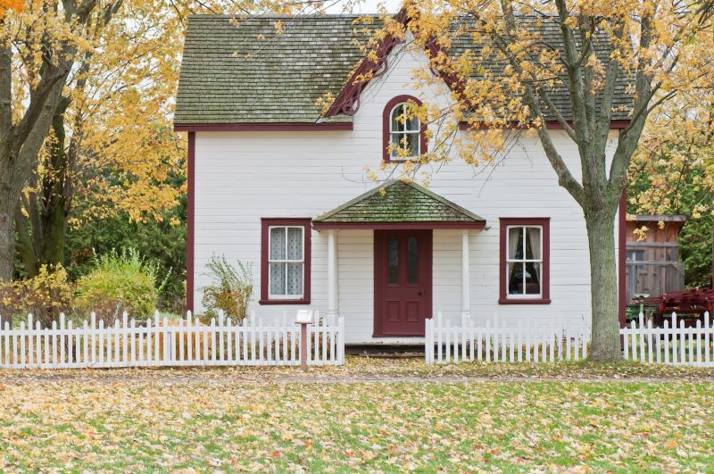
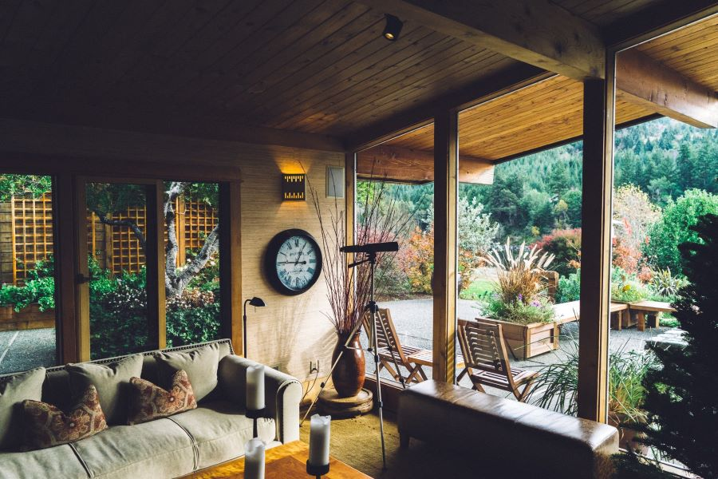

So we came down this road; when we meet other ways--not always were we sure that they were roads at all, for they be neglect and light snow have fallen--the horses know and they only. I give rein to them, and they go on so patient. By-and-by we find all the things which Jonathan have note in that wonderful diary of him.

Then we go on for long, long hours and hours. At the first, I tell Madam Mina to sleep; she try, and she succeed. She sleep all the time; till at the last, I feel myself to suspicious grow, and attempt to wake her. But she sleep on, and I may not wake her though I try. I do not wish to try too hard lest I harm her; for I know that she have suffer much, and sleep at times be all-in-all to her. I think I drowse myself, for all of sudden I feel guilt, as though I have done something; I find myself bolt up, with the reins in my hand, and the good horses go along jog, jog, just as ever.

### All yesterday we travel, ever getting closer to the mountains

I look down and find Madam Mina still sleep. It is now not far off sunset time, and over the snow the light of the sun flow in big yellow flood, so that we throw great long shadow on where the mountain rise so steep. For we are going up, and up; and all is oh! so wild and rocky, as though it were the end of the world.

Then I arouse Madam Mina. This time she wake with not much trouble, and then I try to put her to hypnotic sleep. But she sleep not, being as though I were not. Still I try and try, till all at once I find her and myself in dark; so I look round, and find that the sun have gone down.

> There are darknesses in life and there are lights, and you are one of the lights, the light of all lights. ― Bram Stoker, Dracula

Madam Mina laugh, and I turn and look at her. She is now quite awake, and look so well as I never saw her since that night at Carfax when we first enter the Count's house. I am amaze, and not at ease then; but she is so bright and tender and thoughtful for me that I forget all fear. I light a fire, for we have brought supply of wood with us, and she prepare food while I undo the horses and set them, tethered in shelter, to feed. Then when I return to the fire she have my supper ready.

I go to help her; but she smile, and tell me that she have eat already--that she was so hungry that she would not wait. I like it not, and I have grave doubts; but I fear to affright her and so I am silent of it. She help me and I eat alone; and then we wrap in fur and lie beside the fire, and I tell her to sleep while I watch.

But presently I forget all of watching; and when I sudden remember that I watch, I find her lying quiet, but awake, and looking at me with so bright eyes.Once, twice more the same occur, and I get much sleep till before morning.

### I began to fear that the fatal spell of the place was upon her

When I wake I try to hypnotise her; but alas! though she shut her eyes obedient, she may not sleep. The sun rise up, and up, and up; and then sleep come to her too late, but so heavy that she will not wake. I have to lift her up, and place her sleeping in the carriage when I have harnessed the horses and made all ready. Madam still sleep, and she look in her sleep more healthy and more redder than before. And I like it not. And I am afraid, afraid, afraid!--I am afraid of all things--even to think but I must go on my way. The stake we play for is life and death, or more than these, and we must not flinch.

5 November, morning.--Let me be accurate in everything, for though you and I have seen some strange things together, you may at the first think that I, Van Helsing, am mad--that the many horrors and the so long strain on nerves has at the last turn my brain.
