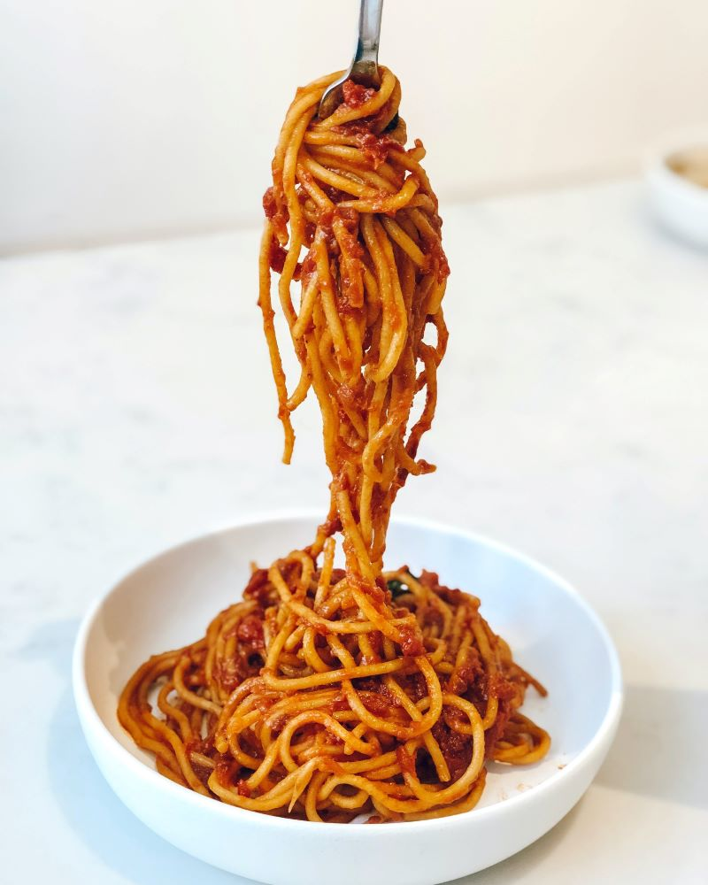

In one point he was more fortunate than the novel's fantastic hero. He never knew--never, indeed, had any cause to know--that somewhat grotesque dread of mirrors, and polished metal surfaces, and still water which came upon the young Parisian so early in his life, and was occasioned by the sudden decay of a beau that had once, apparently, been so remarkable.

It was with an almost cruel joy--and perhaps in nearly every joy, as certainly in every pleasure, cruelty has its place--that he used to read the latter part of the book, with its really tragic, if somewhat overemphasized, account of the sorrow and despair of one who had himself lost what in others, and the world, he had most dearly valued.

### Anything is good if it’s made of chocolate

For the wonderful beauty that had so fascinated Basil Halward, and many others besides him, seemed never to leave him. Even those who had heard the most evil things against him--and from time to time strange rumours about his mode of life crept through London and became the chatter of the clubs--could not believe anything to his dishonour when they saw him.

> All you need is love. But a little chocolate now and then doesn’t hurt. – Charles M. Schulz

He had always the look of one who had kept himself unspotted from the world. Men who talked grossly became silent when Dorian Gray entered the room. There was something in the purity of his face that rebuked them. His mere presence seemed to recall to them the memory of the innocence that they had tarnished. They wondered how one so charming and graceful as he was could have escaped the stain of an age that was at once sordid and sensual.

### Food is the most primitive form of comfort

Often, on returning home from one of those mysterious and prolonged absences that gave rise to such strange conjecture among those who were his friends, or thought that they were so, he himself would creep upstairs to the locked room, open the door with the key that never left him now, and stand, with a mirror, in front of the portrait that Basil Hallward had painted of him, looking now at the evil and aging face on the canvas, and now at the fair young face that laughed back at him from the polished glass. The very sharpness of the contrast used to quicken his sense of pleasure. He grew more and more enamoured of his own beauty, more and more interested in the corruption of his own soul.

1. He would examine with minute care, and sometimes with a monstrous and terrible delight, the hideous lines that seared the wrinkling forehead or crawled around the heavy sensual mouth, wondering sometimes which were the more horrible, the signs of sin or the signs of age.
2. He would place his white hands beside the coarse bloated hands of the picture, and smile. He mocked the misshapen body and the failing limbs.
3. There were moments, indeed, at night, when, lying sleepless in his own delicately scented chamber, or in the sordid room of the little ill-famed tavern near the docks which, under an assumed name and in disguise, it was his habit to frequent, he would think of the ruin he had brought upon his soul with a pity that was all the more poignant because it was purely selfish.
4. But moments such as these were rare. That curiosity about life which Lord Henry had first stirred in him, as they sat together in the garden of their friend, seemed to increase with gratification. The more he knew, the more he desired to know.
5. He had mad hungers that grew more ravenous as he fed them.

### Good food ends with good talk

Yet he was not really reckless, at any rate in his relations to society. Once or twice every month during the winter, and on each Wednesday evening while the season lasted, he would throw open to the world his beautiful house and have the most celebrated musicians of the day to charm his guests with the wonders of their art.

His little dinners, in the settling of which Lord Henry always assisted him, were noted as much for the careful selection and placing of those invited, as for the exquisite taste shown in the decoration of the table, with its subtle symphonic arrangements of exotic flowers, and embroidered cloths, and antique plate of gold and silver.

Indeed, there were many, especially among the very young men, who saw, or fancied that they saw, in Dorian Gray the true realization of a type of which they had often dreamed in Eton or Oxford days, a type that was to combine something of the real culture of the scholar with all the grace and distinction and perfect manner of a citizen of the world. To them he seemed to be of the company of those whom Dante describes as having sought to "make themselves perfect by the worship of beauty.
