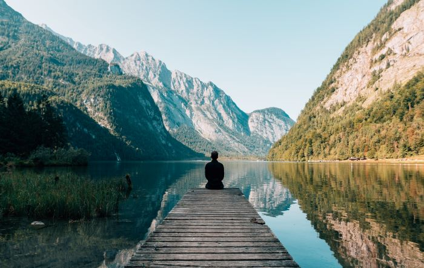

I could not tell the others of the day's discovery till we were alone; so after dinner--followed by a little music to save appearances even amongst ourselves--I took Mina to her room and left her to go to bed. The dear girl was more affectionate with me than ever, and clung to me as though she would detain me; but there was much to be talked of and I came away. Thank God, the ceasing of telling things has made no difference between us.

> Look deep into nature, and then you will understand everything better. -Albert Einstein

When I came down again I found the others all gathered round the fire in the study. In the train I had written my diary so far, and simply read it off to them as the best means of letting them get abreast of my own information; when I had finished Van Helsing said:--

"This has been a great day's work, friend Jonathan. Doubtless we are on the track of the missing boxes. If we find them all in that house, then our work is near the end. But if there be some missing, we must search until we find them. Then shall we make our final coup, and hunt the wretch to his real death." We all sat silent awhile and all at once Mr. Morris spoke:--

"Say! how are we going to get into that house?"

"We got into the other," answered Lord Godalming quickly.

### Theo Roethke shows us the path

"But, Art, this is different. We broke house at Carfax, but we had night and a walled park to protect us. It will be a mighty different thing to commit burglary in Piccadilly, either by day or night. I confess I don't see how we are going to get in unless that agency duck can find us a key of some sort; perhaps we shall know when you get his letter in the morning." Lord Godalming's brows contracted, and he stood up and walked about the room. By-and-by he stopped and said, turning from one to another of us:--

"Quincey's head is level. This burglary business is getting serious; we got off once all right; but we have now a rare job on hand--unless we can find the Count's key basket."

As nothing could well be done before morning, and as it would be at least advisable to wait till Lord Godalming should hear from Mitchell's, we decided not to take any active step before breakfast time. For a good while we sat and smoked, discussing the matter in its various lights and bearings; I took the opportunity of bringing this diary right up to the moment. I am very sleepy and shall go to bed....

Just a line. Mina sleeps soundly and her breathing is regular. Her forehead is puckered up into little wrinkles, as though she thinks even in her sleep. She is still too pale, but does not look so haggard as she did this morning. To-morrow will, I hope, mend all this; she will be herself at home in Exeter.

Oh, but I am sleepy! 1 October.--I am puzzled afresh about Renfield. His moods change so rapidly that I find it difficult to keep touch of them, and as they always mean something more than his own well-being, they form a more than interesting study. This morning, when I went to see him after his repulse of Van Helsing, his manner was that of a man commanding destiny.

He was, in fact, commanding destiny--subjectively. He did not really care for any of the things of mere earth; he was in the clouds and looked down on all the weaknesses and wants of us poor mortals. I thought I would improve the occasion and learn something, so I asked him:-

"What about the flies these times?" He smiled on me in quite a superior sort of way--such a smile as would have become the face of Malvolio--as he answered me:--

"The fly, my dear sir, has one striking feature; its wings are typical of the aërial powers of the psychic faculties. The ancients did well when they typified the soul as a butterfly!"
