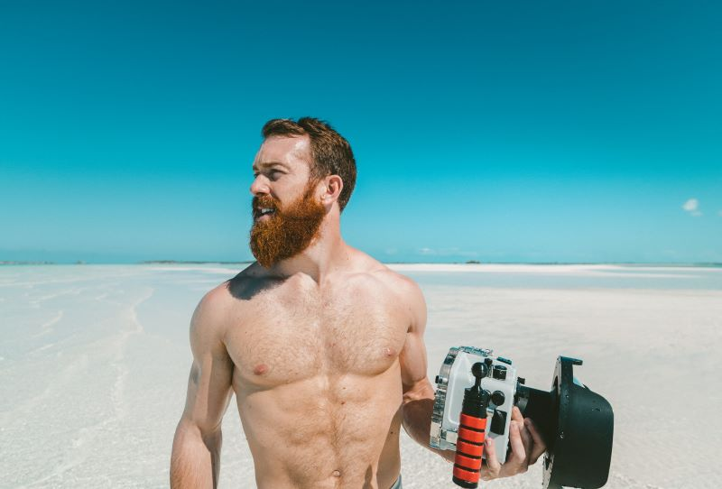

Before long the searchlight discovered some distance away a schooner with all sails set, apparently the same vessel which had been noticed earlier in the evening. The wind had by this time backed to the east, and there was a shudder amongst the watchers on the cliff as they realized the terrible danger in which she now was. Between her and the port lay the great flat reef on which so many good ships have from time to time suffered, and, with the wind blowing from its present quarter, it would be quite impossible that she should fetch the entrance of the harbour.

### Wherever you go, go with all your heart

It was now nearly the hour of high tide, but the waves were so great that in their troughs the shallows of the shore were almost visible, and the schooner, with all sails set, was rushing with such speed that, in the words of one old salt, "she must fetch up somewhere, if it was only in hell.

Then came another rush of sea-fog, greater than any hitherto--a mass of dank mist, which seemed to close on all things like a grey pall, and left available to men only the organ of hearing, for the roar of the tempest, and the crash of the thunder, and the booming of the mighty billows came through the damp oblivion even louder than before.

> A mind that is stretched by a new experience can never go back to its old dimensions

The rays of the searchlight were kept fixed on the harbour mouth across the East Pier, where the shock was expected, and men waited breathless. The wind suddenly shifted to the north-east, and the remnant of the sea-fog melted in the blast; and then, mirabile dict, between the piers, leaping from wave to wave as it rushed at headlong speed, swept the strange schooner before the blast, with all sail set, and gained the safety of the harbour.

### Life is short and the world is wide

- The searchlight followed her, and a shudder ran through all who saw her, for lashed to the helm was a corpse, with drooping head, which swung horribly to and fro at each motion of the ship.
- No other form could be seen on deck at all. A great awe came on all as they realised that the ship, as if by a miracle, had found the harbour, unsteered save by the hand of a dead man! However, all took place more quickly than it takes to write these words.
- The schooner paused not, but rushing across the harbour, pitched herself on that accumulation of sand and gravel washed by many tides and many storms into the south-east corner of the pier jutting under the East Cliff, known locally as Tate Hill Pier.

> Without new experiences, something inside of us sleeps. The sleeper must awaken. – Frank Herbert

There was of course a considerable concussion as the vessel drove up on the sand heap. Every spar, rope, and stay was strained, and some of the "top-hammer" came crashing down. But, strangest of all, the very instant the shore was touched, an immense dog sprang up on deck from below, as if shot up by the concussion, and running forward, jumped from the bow on the sand.

Making straight for the steep cliff, where the churchyard hangs over the laneway to the East Pier so steeply that some of the flat tombstones--"thruff-steans" or "through-stones," as they call them in the Whitby vernacular--actually project over where the sustaining cliff has fallen away, it disappeared in the darkness, which seemed intensified just beyond the focus of the searchlight.

It so happened that there was no one at the moment on Tate Hill Pier, as all those whose houses are in close proximity were either in bed or were out on the heights above. Thus the coastguard on duty on the eastern side of the harbour, who at once ran down to the little pier, was the first to climb on board. The men working the searchlight, after scouring the entrance of the harbour without seeing anything, then turned the light on the derelict and kept it there.
