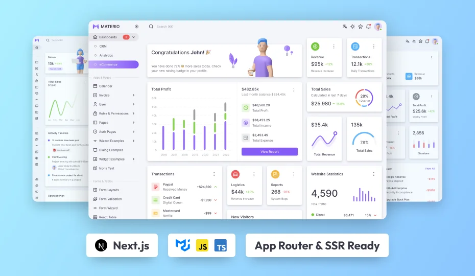

# Rock JS Admin Dashboard Design

Ready for production 🤩, user-friendly, and incredibly customizable Next JS Admin Template Free & Pro has everything you need to quickly create contemporary, attractive, and responsive online apps! 🚀

**[Templates 1, Jakarta React NextJs Admin Pro](https://superapp.mayar.link/catalog/jakarta-react-nextjs-admin-pro)**

### **Next Free & Pro JS Admin Dashboard Template**

A free and open-source web development framework for creating React-based web applications is called **NextJS**. The React JS Library serves as the foundation for it. In addition, NextJS simplifies the process of developing quick and responsive websites. Our NextJS admin panel templates are typically built with ReactJS and MUI, which provide you with the best developer experience and all the features you need for production: server side rendering, support for TypeScript and Javascript, smart bundling, route pre-fetching, and more. MUI, on the other hand, provides a full suite of UI tools and components that are ready for production. Using our established design methodology, we at **JakartaJs** provide professionally crafted, responsive Material UI-based **Next JS admin Template** free & Pro Dashboard, as well as **UI Kits** that combine the best aspects of both worlds. For a more comprehensive overview, you may alternatively use the NextJS Admin Template Free that we offer.

#### What is included in the NextJS admin template and what is it?

As the user interface of a web application's backend, **Admin templates** are essentially a collection of web pages created with **HTML, CSS, and JavaScript** or any **JavaScript libraries**. To carry out backend functions like tracking and managing users, products, orders, bookings, appointments, website content, performance, etc., these pre-built pages are integrated with the web application.

Website administration is made simple with these **Admin templates**, which are well-designed and straightforward. One of the greatest web app framework options is **NextJS**, which offers lightning-fast performance. You may find the most well-designed and user-friendly **Next JS admin dashboard templates** on ThemeSelection. A **starter kit** is also included, which will make it simple for you to get started on your next project.

#### In what ways may I use the Next JS Dashboard template?

You can gain a lot of advantages by utilizing the **production-ready** Next js admin template. To begin with, the templates are **high quality** and **search engine optimized**. This implies that they will assist you in improving your website's search engine ranking and drawing more users to it. You also won't have to invest hours in starting from zero when designing your own design.

Secondly, you may **save** a substantial sum of **money** and **time** with Next JS dashboards. They are **very customizable** and simple to use, enabling users to alter the template's appearance and feel to suit their needs. Ultimately, you may differentiate yourself from the competition by giving your website a more polished and professional appearance with the **Next js dashboard template Free &** Pro.

#### What and how can I construct using the Next JS Templates?

We can now guarantee that you will find our Material UI React **Next JS admin** templates to be easy to use and developer-friendly. However, you need to know the fundamentals of React. In addition, the templates include an installation and usage guide and step-by-step documentation. In addition, the templates include a **Starter kit** that will assist you in getting started on your project more rapidly rather than deleting unnecessary items.

You can also test out our **free admin templates** first. The **Next JS admin template Free** makes it simple to examine the **folder structure** and **code quality**. Following that, you can upgrade to the premium edition, which has additional features and components required for web apps of a professional caliber.

Furthermore, as the Next js template Free is appropriate for any industry—including education, management, finance, health, and fitness—you may use it for any type of online application.

For example, using our **Next JS Dashboard**, you may create,

The list goes on and on: CRM, ERP, eCommerce, Banking, Fitness, Education, Medical, and so forth.

Isn't that fantastic? 🤩

#### Assistance

Depending on the license you buy, you will receive **free updates** and support for a whole year or for eternity. For every product, we have produced **excellent docs**, which are accessible online. Our documentation and assistance are simply accessible from any location in the globe.

Additionally, we provide **GitHub repository access** for easier issue tracking and updates. You will receive **first-rate assistance** straight from the product developers. So, why do you hesitate? Now, grab your next JS admin panel template 🤩